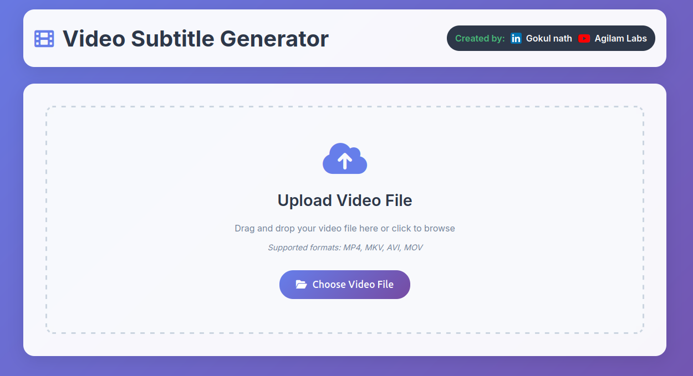
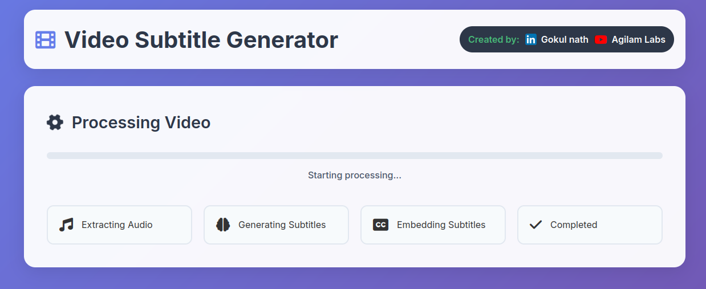
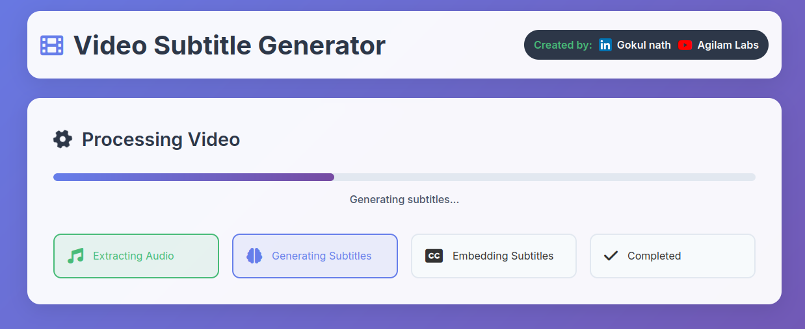
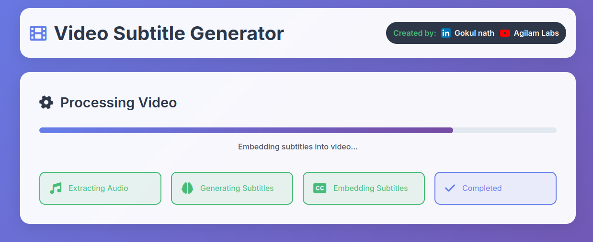
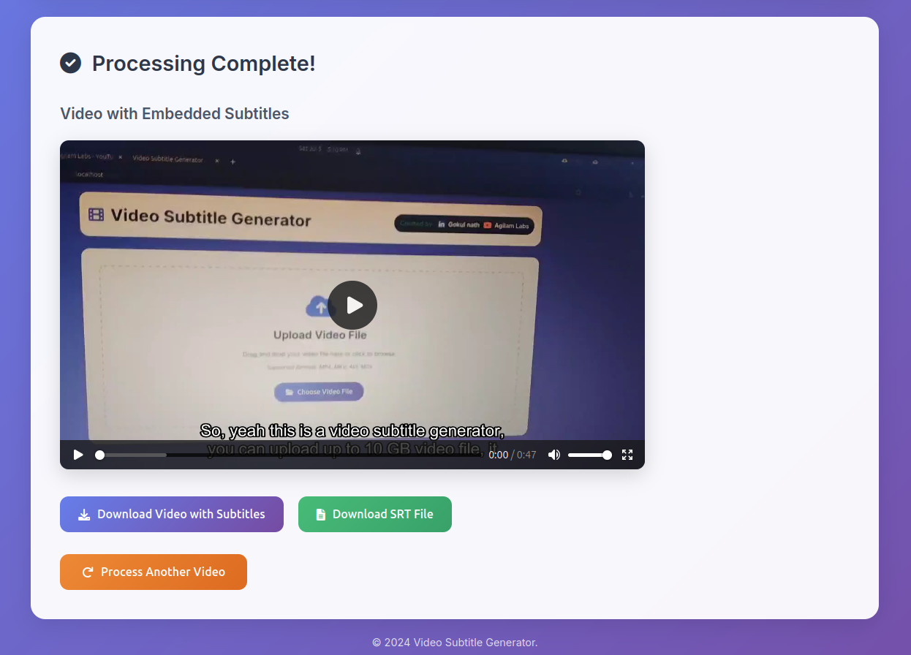

# 🎬 Video Subtitle Generator with Flask 📝

This repository contains a modern web application that generates subtitles from video files using **Flask**, **HTML/JavaScript**, and **OpenAI's Whisper** model. The application extracts audio from the video, transcribes it to generate subtitles, and embeds them back into the video.

## 📚 Table of Contents

- [✨ Features](#features)
- [🚀 Demo](#demo)
- [🛠️ Installation](#installation)
- [�� Usage](#usage)
- [🖼️ Screenshots](#screenshots)
- [🧰 Technologies Used](#technologies-used)
- [🙏 Acknowledgments](#acknowledgments)
- [🤝 Connect with Me](#connect-with-me)

---

## ✨ Features

- 🎥 Upload video files in **MP4, MKV, AVI, or MOV** formats.
- 🔈 Extracts audio from the video.
- 🧠 Generates subtitles using **OpenAI's Whisper** model.
- 💬 Subtitles are saved in **SRT format**.
- 🖼️ Embeds subtitles directly into the video.
- 💻 Modern and responsive web interface built with **HTML, CSS, and JavaScript**.
- 📱 Fully responsive design that works on desktop and mobile devices.
- ⚡ Real-time progress tracking with visual feedback.

## 🚀 Demo

You can try a live demo of the application by uploading a video and generating subtitles.

[](https://your-demo-link.com)

## 🛠️ Installation

To run this application locally, follow these steps:

### Prerequisites

Make sure you have the following installed:

- **Python 3.8 or higher**
- **FFmpeg**

### Steps

1. **Clone the repository:**

    ```bash
    git clone https://github.com/yourusername/video-subtitle-generator.git
    cd video-subtitle-generator
    ```

2. **Create a virtual environment:**

    ```bash
    python -m venv venv
    source venv/bin/activate  # For macOS and Linux
    venv\Scripts\activate     # For Windows
    ```

3. **Install dependencies:**

    ```bash
    pip install -r requirements.txt
    ```

4. **Run the Flask app:**

    ```bash
    python app.py
    ```

5. Open the application in your browser:

    ```
    http://localhost:5000
    ```

## 📝 Usage

1. Open the app in your browser.
2. 🎥 Upload a video file by dragging and dropping or clicking the upload area.
3. The app will:
   - 🔈 Extract audio from the video.
   - 🧠 Generate subtitles using **Whisper**.
   - 💬 Embed the subtitles into the video.
4. 📥 Download the generated subtitles as an SRT file.
5. 🎬 Play the video with embedded subtitles directly in the app.
6. 🔄 Process another video using the reset button.

## 🖼️ Screenshots

Below are screenshots demonstrating the UI process of the Video Subtitle Generator:

### 1. Home Page - Upload Video


### 2. Processing Started


### 3. Generating Subtitles


### 4. Embedding Subtitles


### 5. Processing Complete & Video Preview


## 🧰 Technologies Used

- **🖥️ Flask** - For building the web application backend.
- **🎨 HTML/CSS/JavaScript** - For the modern, responsive frontend interface.
- **🔊 OpenAI's Whisper** - For speech-to-text transcription.
- **🎥 FFmpeg** - For processing video and embedding subtitles.
- **📝 Python** - For the application backend logic.

## 🙏 Acknowledgments

This project utilizes:

- **Whisper by OpenAI** for generating accurate subtitles.
- **FFmpeg** for audio extraction and embedding subtitles.
- **Flask** for the web framework.

## 🤝 Connect with Me

- [](https://www.youtube.com/@agilamlabs)
- [](https://www.linkedin.com/in/gn-raavanan)

## Thank You
